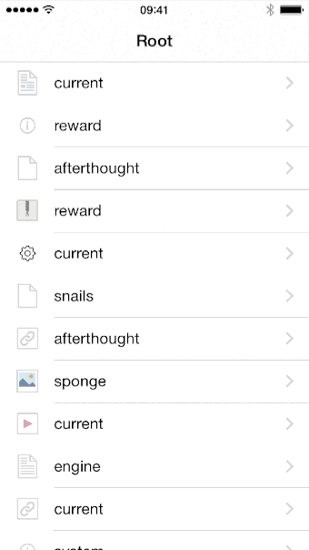

# ios-multi-back-button

Replacement for the built-in UInavigationController back-button that allows going back multiple
levels. 

Users long-tap the back-button to display a table with the viewControllers in the current navigation
stack. They either lift the finger and tap a table-cell or move it above the table and release above 
the cell for the view-controller you want to navigate to. If they do a regular tap, the back-button 
will bring you back a single level as usual.
  

You configure a view-controller to use there buttons with somelink like

````
#import "MultiBackButtonItem.h"
 ⋮
- (void)viewDidLoad {
    [super viewDidLoad];

    [self configureMultiBackButton];
    self.multiBackButtonImage = [UIImage imageNamed: @"myImage"];
}
````

You need to include `MultiBackButtonItem.h`, `MultiBackButtonItem.m` and the `back` image found in the `Images.xcassets` in your project.

Because I have not reliable way to determine how much space is available in the navigation bar, the
back-button never shows the title of the previous view controller. I would much rather it included a title 
if there was sufficient space for this and you can find some traces of attempts at this. Suggestions on
how to do it are very welcome.

You can reach me as [@palmin](https://twitter.com/palmin) on Twitter
